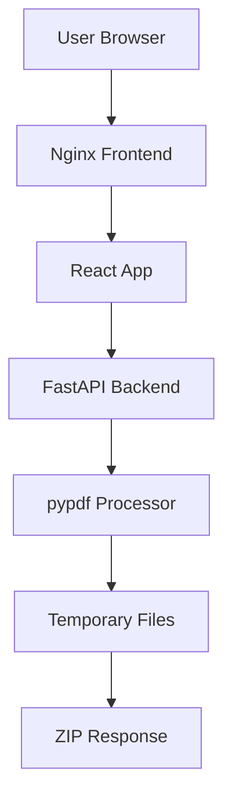

# 🔪 PDF Splitter - Drag & Drop PDF Page Extractor

A modern, user-friendly web application for splitting PDF files by extracting specific pages or page ranges. Built with **FastAPI** (Python) backend and **React + TypeScript** frontend, featuring an intuitive drag-and-drop interface.


*Demo GIF placeholder - Upload PDF (up to 130MB), specify ranges like `1-5,8,10-12`, and download as ZIP*

## ✨ Features

- **🖱️ Drag & Drop Interface** - Intuitive file upload with visual feedback
- **📄 Page Range Selection** - Flexible syntax: `1-5,8,10-12` for complex extractions  
- **⚡ Fast Processing** - Stream-based PDF handling for large files (up to 130MB)
- **📦 ZIP Download** - Automatically packages extracted pages as `original_split.zip`
- **🌙 Dark Mode** - Toggle between light and dark themes
- **🔒 Memory Safe** - Processes files without loading entire PDF into memory
- **✅ Live Validation** - Real-time syntax checking and error feedback
- **🐳 Docker Ready** - One-command deployment with `docker compose up`

## 🚀 Quick Start

### 🌐 Live Demo

Try the application online: **[PDF Splitter on Vercel](https://pdf-splitter-ca3cufdsr-abecos-projects.vercel.app)**

### Using Docker (Recommended)

```bash
# Clone the repository
git clone https://github.com/abecoko/pdf-splitter.git
cd pdf-splitter

# Start the application
docker compose up -d
# or use the convenience script
./start.sh

# Access the application
open http://localhost:3000
```

### Deploy to Vercel

[](https://vercel.com/new/clone?repository-url=https%3A%2F%2Fgithub.com%2Fabecoko%2Fpdf-splitter)

```bash
# Install Vercel CLI
npm i -g vercel

# Deploy
vercel --prod
```

### Manual Setup

#### Backend (Python 3.12)
```bash
cd backend
pip install -r requirements.txt
uvicorn main:app --reload --host 0.0.0.0 --port 8000
```

#### Frontend (Node.js 18+)
```bash
cd frontend
npm install
npm run dev
```

## 📁 Project Structure

```
pdf-splitter/
├── backend/                 # FastAPI application
│   ├── main.py             # API endpoints & middleware
│   ├── split_pdf.py        # PDF processing logic
│   ├── schemas.py          # Pydantic models
│   ├── tests/              # Pytest test suite
│   ├── requirements.txt    # Python dependencies
│   └── Dockerfile         # Backend container
├── frontend/               # React TypeScript app
│   ├── src/
│   │   ├── App.tsx        # Main application component
│   │   ├── components/
│   │   │   ├── DropZone.tsx    # File upload interface
│   │   │   └── RangeInput.tsx  # Page range input with validation
│   │   └── utils/parseRange.ts # Range parsing utilities
│   ├── index.html         # Entry HTML
│   ├── vite.config.ts     # Vite bundler config
│   └── Dockerfile         # Frontend container
├── docker-compose.yml     # Production deployment
├── docker-compose.dev.yml # Development environment
├── Makefile              # Common commands
└── README.md            # This file
```

## 🛠️ Development

### Available Commands (Makefile)

```bash
make help        # Show all available commands
make dev         # Start development environment
make build       # Build production images  
make run         # Run production environment
make test        # Run backend tests
make clean       # Clean up containers and images
make logs        # View service logs
```

### Running Tests

```bash
# Backend tests (100% coverage on core functions)
cd backend && python -m pytest tests/ -v

# Test range parser specifically
pytest tests/test_split_pdf.py::TestParsePageRanges -v
```

### Page Range Format

The application supports flexible page range syntax:

| Input | Description | Result |
|-------|-------------|---------|
| `5` | Single page | Page 5 |
| `1-5` | Range | Pages 1 through 5 |
| `1-3,5,7-9` | Mixed | Pages 1,2,3,5,7,8,9 |
| `1,3,5-7` | Complex | Pages 1,3,5,6,7 |

### API Endpoints

- `GET /` - API information
- `GET /health` - Health check
- `POST /split` - Split PDF (multipart form: `file` + `page_ranges`)

## 🔧 Configuration

### Environment Variables

| Variable | Default | Description |
|----------|---------|-------------|
| `PORT` | `8000` | Backend server port |
| `MAX_FILE_SIZE` | `130MB` | Maximum upload size |
| `TIMEOUT_KEEP_ALIVE` | `180` | Request timeout (seconds) |

### Docker Compose Override

Create `docker-compose.override.yml` for custom configurations:

```yaml
version: '3.8'
services:
  frontend:
    ports:
      - "8080:80"  # Change frontend port
  backend:
    environment:
      - MAX_FILE_SIZE=200000000  # Increase file limit
```

## 🏗️ Architecture



### Security Features

- **File Type Validation** - Only accepts PDF MIME types
- **Size Limits** - Configurable upload size restrictions  
- **Path Sanitization** - Prevents directory traversal in ZIP files
- **Temporary Cleanup** - Automatic file deletion after processing
- **Input Validation** - Comprehensive range syntax checking

## 🚨 Troubleshooting

### Quick Diagnosis

```bash
# Check if services are running
make status

# Test connectivity
make debug

# View logs
make logs
```

### Common Issues

**Cannot Access http://localhost:3000**
```bash
# Check if containers are running
docker compose ps

# Rebuild and restart
make clean && make run

# For development environment
make dev
```

**Large File Upload Fails**
```bash
# Increase timeout in docker-compose.yml
environment:
  - TIMEOUT_KEEP_ALIVE=300
```

**Out of Memory Errors**
```bash
# The app uses streaming, but if issues persist:
docker compose down && docker system prune -f
```

**Permission Errors**
```bash
# Ensure temp directory is writable
chmod 755 /tmp
```

### Logs and Debugging

```bash
# View real-time logs
make logs

# Backend-specific logs
docker compose logs backend -f

# Check service health
docker compose ps

# Test API directly
curl http://localhost:3000/api/health
```

### Port Conflicts

If port 3000 is in use:
```bash
# Check what's using port 3000
lsof -i :3000

# Use different port
docker compose down
# Edit docker-compose.yml ports section
# Change "3000:80" to "8080:80"
docker compose up -d
```

## 🤝 Contributing

1. Fork the repository
2. Create a feature branch: `git checkout -b feature/amazing-feature`
3. Run tests: `make test`
4. Commit changes: `git commit -m 'Add amazing feature'`
5. Push to branch: `git push origin feature/amazing-feature`
6. Open a Pull Request

### Code Quality

The project maintains high standards:
- **Backend**: Black formatting, type hints, 100% test coverage on core functions
- **Frontend**: ESLint, TypeScript strict mode, component testing
- **Security**: Input validation, file type checking, path sanitization

## 📄 License

This project is licensed under the MIT License - see the [LICENSE](LICENSE) file for details.

## 🙏 Acknowledgments

- **pypdf** - Robust PDF processing library
- **FastAPI** - Modern Python web framework  
- **React + Vite** - Fast frontend development
- **Tailwind CSS** - Utility-first styling
- **Lucide React** - Beautiful icon library

---

**Built with ❤️ using FastAPI, React, and TypeScript**

[](https://github.com/your-username/pdf-splitter)
[](https://hub.docker.com/r/your-username/pdf-splitter)
[](https://opensource.org/licenses/MIT)