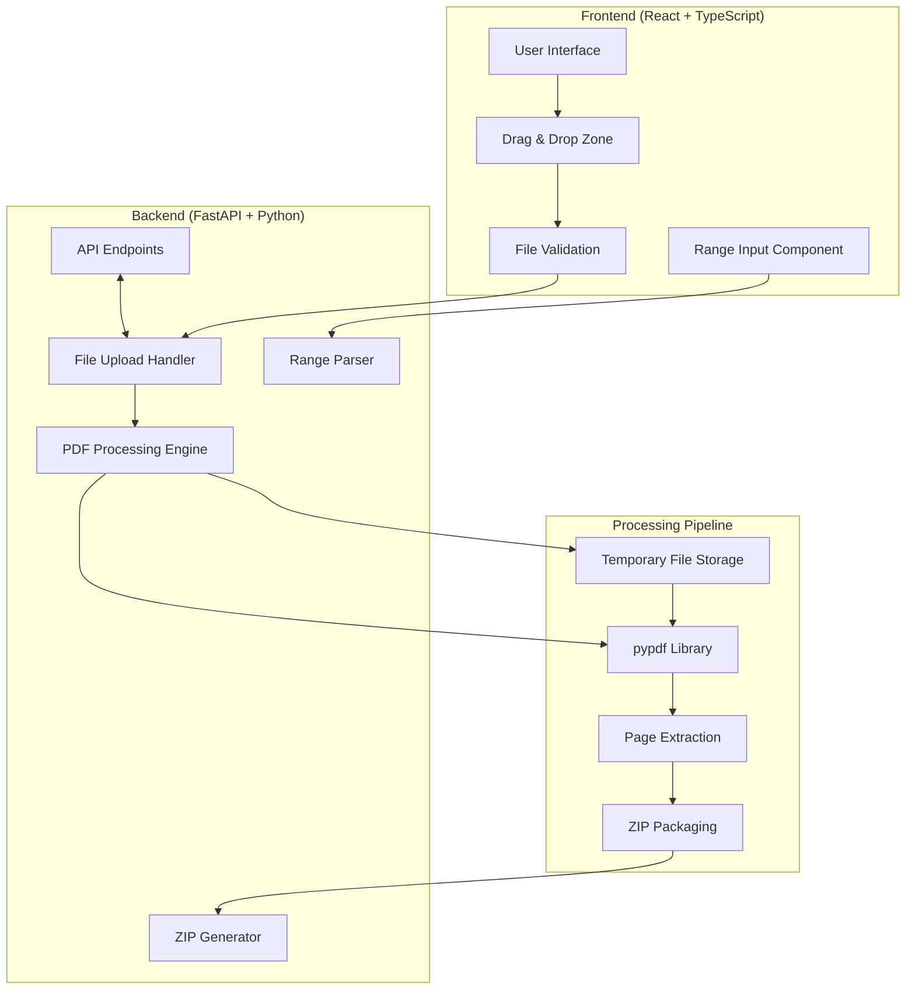

# Architecture Overview

## System Architecture

## Component Breakdown

### Frontend Components
- **DropZone.tsx**: Drag-and-drop file upload interface
- **RangeInput.tsx**: Page range input with live validation
- **App.tsx**: Main application orchestrator
- **parseRange.ts**: Client-side range validation utilities

### Backend Components
- **main.py**: FastAPI application with middleware
- **split_pdf.py**: Core PDF processing logic
- **schemas.py**: Pydantic data models

## Data Flow

1. **File Upload**: User drags PDF into DropZone component
2. **Validation**: Client validates file type/size, server re-validates
3. **Range Input**: User specifies pages using flexible syntax
4. **Processing**: Backend streams PDF, extracts pages using pypdf
5. **Packaging**: Extracted pages bundled into ZIP file
6. **Download**: Client automatically downloads ZIP file

## Security Considerations

- File type validation (MIME type checking)
- Size limitations (130MB max)
- Path sanitization in ZIP files
- Temporary file cleanup
- Input validation and sanitization

## Performance Optimizations

- Streaming file upload/download
- Memory-efficient PDF processing
- Temporary file cleanup
- Client-side validation to reduce server load
- Docker container optimization